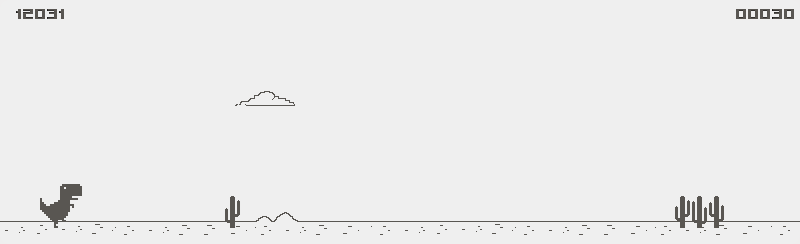

# EnTT Dino

<p align="center">
  
</p>

[](LICENSE)


## Introduction

**EnTT Dino** is a clone of the [Dinosaur Game](https://en.wikipedia.org/wiki/Dinosaur_Game) built using only [SDL2](https://www.libsdl.org/) and the [EnTT](https://github.com/skypjack/entt) entity component system library.  
The motivation behind this project is to gain experience with the foundational features of a game engine, such as rendering, resource management, and state handling, while giving the entity component system (ECS) paradigm a thorough test in a real-world scenario.  
By using just SDL2 and EnTT, the project remains lightweight and focused, allowing for a deeper understanding of how these systems interact and how to build up game engine features from scratch.

<p align="center">
  
</p>

## Engine Features

- [x] **Entity Manager**: EnTT-based, fast and flexible ECS.
- [x] **Resource Manager**: Handles loading and caching of fonts, sprites, and sounds.
- [x] **Scene Manager**: Supports multiple scenes and transitions.
- [x] **State System**: Clean separation of game states (running, jumping, ducking, dead, etc).
- [x] **HUD System**: Displays score, high score, and game over screen.
- [x] **Event System**: Decoupled event dispatching for game logic.

## Game Features

- [x] **Running, Jumping, Ducking**: Responsive dino controls.
- [x] **High Scores**: Persistent high score tracking.
- [x] **Cactii & Pterodactyl Enemies**: Multiple enemy types with collision detection.
- [x] **Incremental Difficulty**: Game speed and spawn rates increase as you score points.
- [x] **Night Mode**: Dynamic background transitions and moon/stars.
- [x] **Sound Effects**: Jump, death, and other game sounds.
- [x] **Animated Sprites**: Dino, pterodactyl, ducking, and stars are animated.
- [x] **Score Flashing**: Score flashes every 100 points.
- [x] **Parallax Background**: Clouds, moon, and stars move at different speeds.
- [x] **FPS Counter**: Real-time frames-per-second display in the HUD.

## Dependencies

- [CMake](https://cmake.org/) version 3.7 or later.
- [SDL2](https://www.libsdl.org/),
[SDL2_image](https://github.com/libsdl-org/SDL_image) for input and
rendering, [SDL2_ttf](https://github.com/libsdl-org/SDL_ttf) for fonts and [SDL2_mixer](https://github.com/libsdl-org/SDL_mixer) for sounds.

To install these on `Arch Linux`:

```sh
sudo pacman -S cmake sdl2 sdl2_image sdl2_ttf sdl2_mixer
```

For other platforms and distributions please refer to your package manager's
documentation or visit the official [installation instructions](https://wiki.libsdl.org/Installation).

## Building

To build simply run:

```sh
cd build/
cmake ..
make
```

The resultant `entt_dino` executable can then be found in `bin/`.

## Licence

Copyright (c) 2025 Tobias Backer Dirks.

Code released under [the MIT licence](LICENCE).
